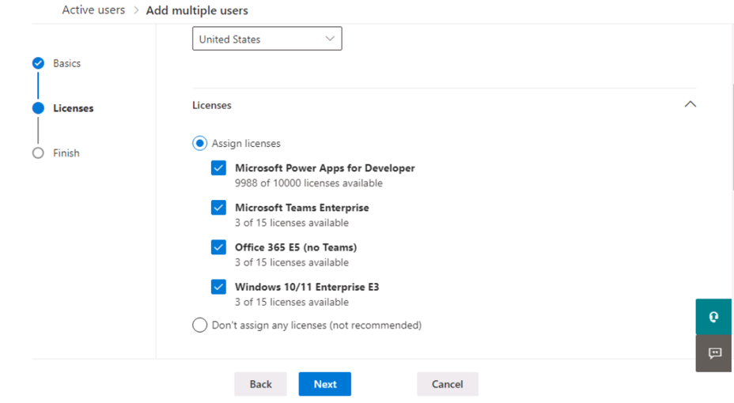

# **Lab 0: Setting up lab environment**

### **Task 1: Assign** **Power Apps trial license** 

1.  Open a web browser on your VM and go to
    +++https://powerapps.microsoft.com/en-us/free/+++ .

     

2.  Select **Start free**.

    **Note**: If **Start free** is not working, zoom in (ctrl--) on the current screen and select **Sign in** from the to-right corner. 
     
     

3.  Enter your **Office 365 admin credential**, check the checkbox to
    **accept the agreement** and click on **Start your free trial**.

     

4.  Enter **password of your Office 365 tenant id** and then select
    **Sign in**.

     

5.  Select **Yes** on **Stay signed in?** pop-up window.

     

6.  You can now see **Home page of Power Apps.** From the environment
    selector, select the developer environment – **Dev One** which is
    created for you.

     

7.  Open the new tab and go to Power Platform admin center by navigating
    to +++https://admin.powerplatform.microsoft.com+++ and if required, sign
    in using your given Office 365 tenant admin credentials.

     

8.  From the left navigation pane, select **Environments** and then you
    can see, **Dev One** is your Dataverse environment.

     

### **Task 2: Creating Microsoft 365 Users**

1.  Open Import_Users_Contoso.csv file from **C:\Labfiles** folder on your Lab VM.

2.  Under the Username column, update the tenant name to reflect your Office 365 tenant name for each user in the list and then save as a CSV format file.

    E.g. if your Office 365 tenant is admin@LODSA7xx479.onmicrosoft.com, your domain would be LODSA7xx479.
   
    eg : brookeg@LODSA7xx479.onmicrosoft.com

3.  Navigate to the Microsoft 365 admin center using +++https://admin.microsoft.com+++ 

4.  From the left navigation, select **Users** > **Active users** page, click **Add multiple users**.

     

5.  On the Upload a CSV file with user info pane, select **I’d like to upload a CSV with user information** and then click **Browse**. 

     

6. In the Open dialog box, navigate **C:\Labfiles\ Import_Users_Contoso.csv** and click **Open**.

     

7. Once the CSV file passed verification, click **Next**.

     

    **NOTE**: If you receive an error message, review your CSV file for errors, and fix them

8. On the Licenses pane, select all licenses check boxes and click **Next**.

     

9. On the **Review and finish adding multiple users** pane, click **Add users**.

    

10. On the **You added 11 users** pane, click **Close**.

    

11. On the **Active users** page, select all the new users, (except MOD Admin) then click on **Reset password**.

    

12. To reset the same password for all the users, uncheck all check boxes and enter password as : +++Pa$$w0rd@124+++ and then click on **Reset password**.

    

13. On the **Reset password** pane, click **Close**.

    

