# **Lab 3: Creating a flow using the cloud flows designer with Copilot**

### **Task 1: Create a flow using Copilot**

1.  Sign in to +++https://make.powerautomate.com/+++ with your Office 365
    admin tenant credentials.

2.  Select **Dev One** environment from environment selector.

     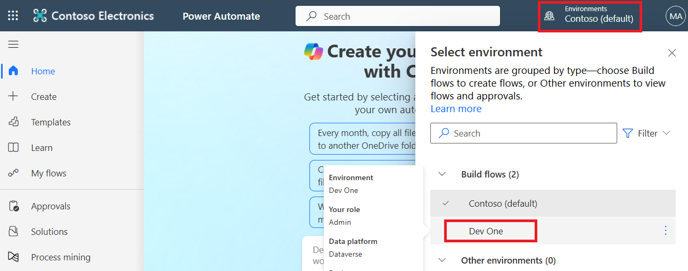

3.  In the text box under Create your automation with copilot, type
    +++**When a new item is created in SharePoint, send me an email**+++ and
    then click on **Generate** button.

     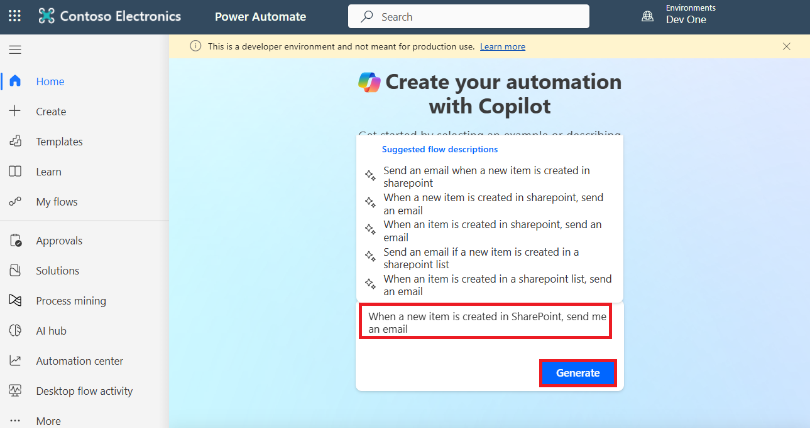

4.  Copilot will suggest a flow as per your description.

     

5.  For this scenario, you need to first create a List in SharePoint. In
    power Automate, click on **App launcher** at the top left. Select
    **SharePoint**.

     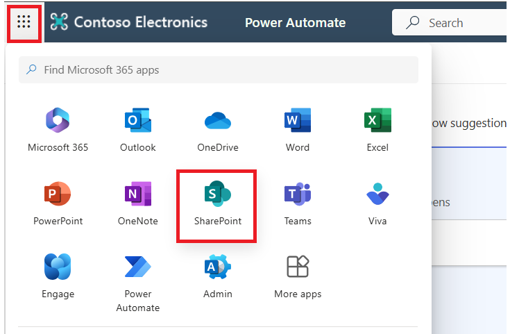

6.  You can observe that you are signed in with your Office 365 tenant
    credentials. Select **Not now** on the Welcome pop-up.

     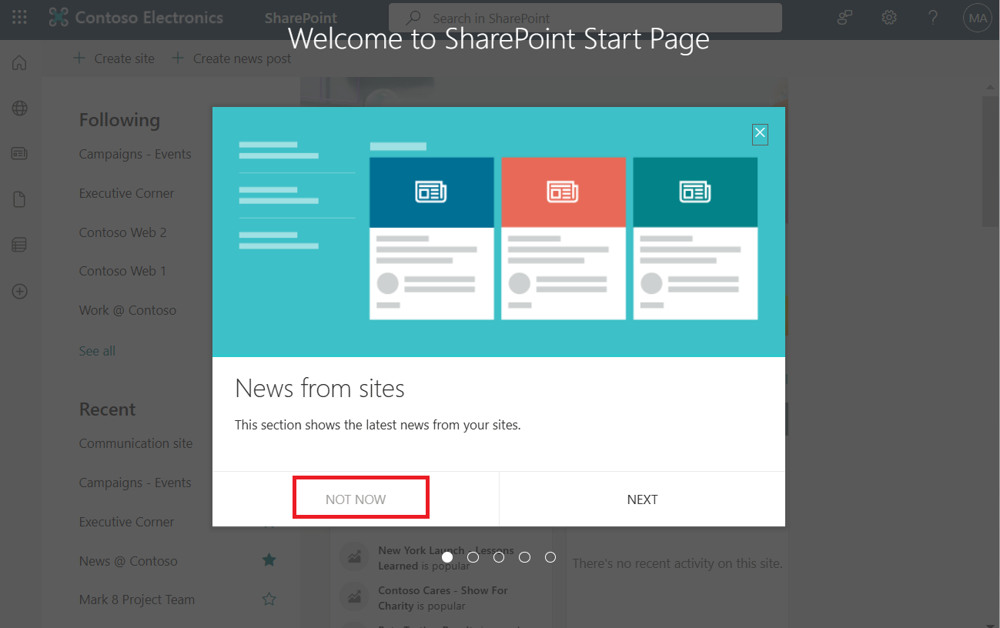

7.  Select **+Create site** on SharePoint Home page.

     

8.  Select **Communication site**.

     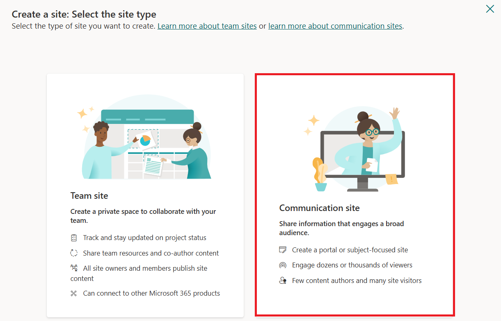

9.  On **Select a template** page, scroll down and click on **Blank**
    template.

     

10. Click on **Use template**.

     

11. Enter **Site name** – +++Testing+++, **site description** – +++Training+++, keep
    the generated site address as is and then select **Next**.

     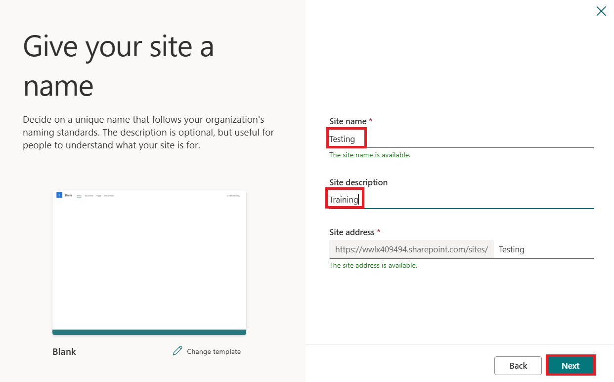

12. Select **English** as site language and then select **Create site**.

     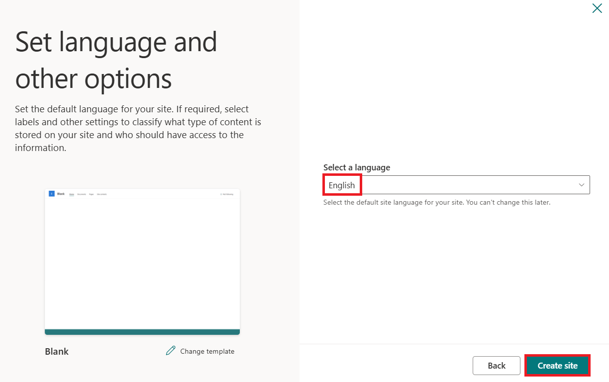

13. Select **+New > List**.

     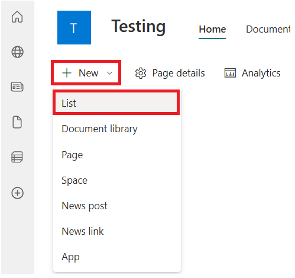

14. Select **Blank list** under Create a list.

     

15. Enter the **List name*** -+++Mylist+++ and select **Create**.

     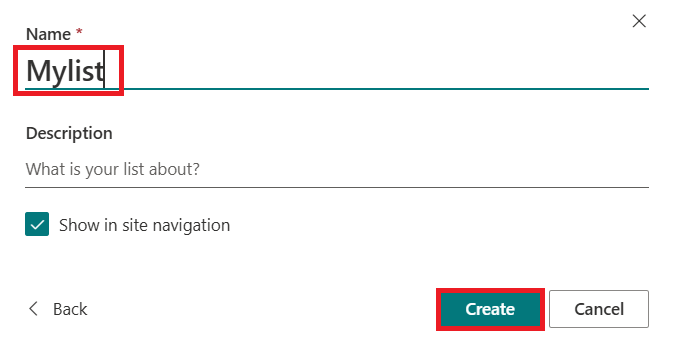

16. Go back to the Power Automate window.

17. Review the AI generated flow suggestion and select **Next** or **Keep it and continue**.

    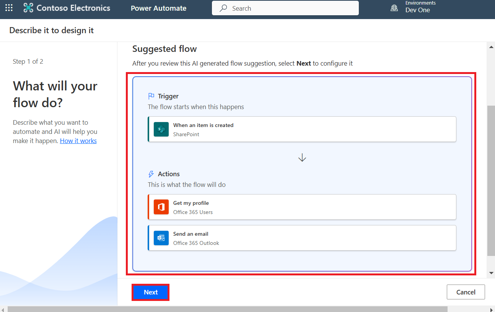

18. Review your connected apps and services and select **Create flow**.

     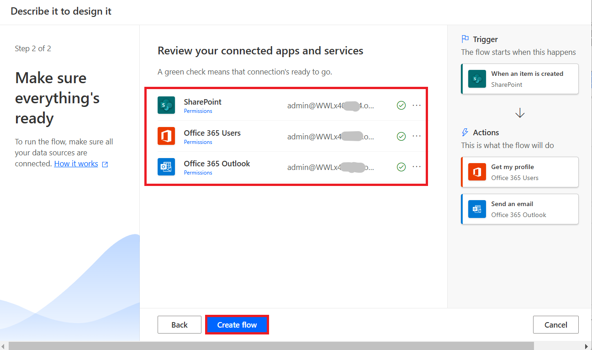

19. For a better view, close the Copilot pane.

     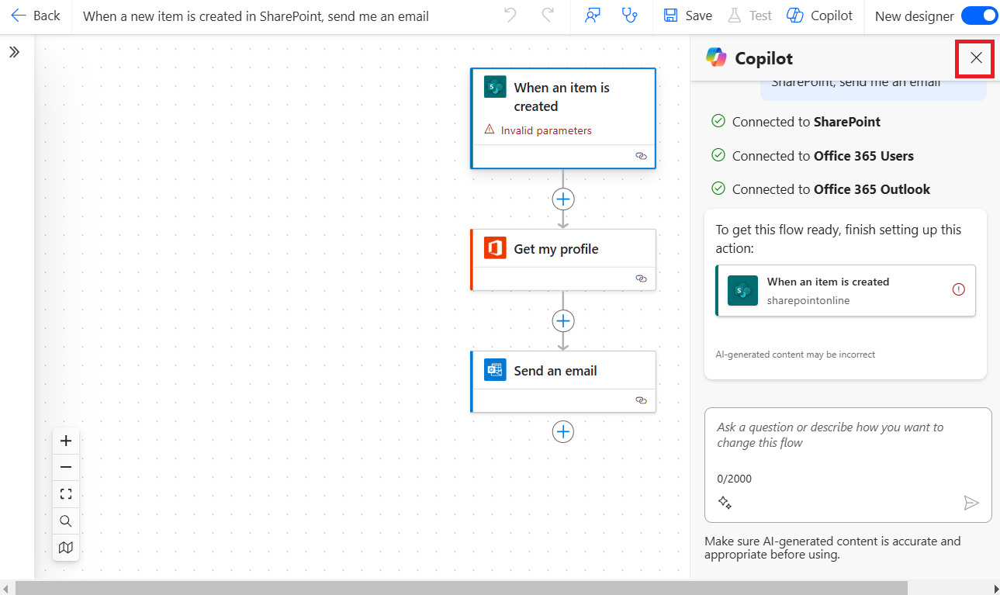

20. Select **When an item is created** step.

     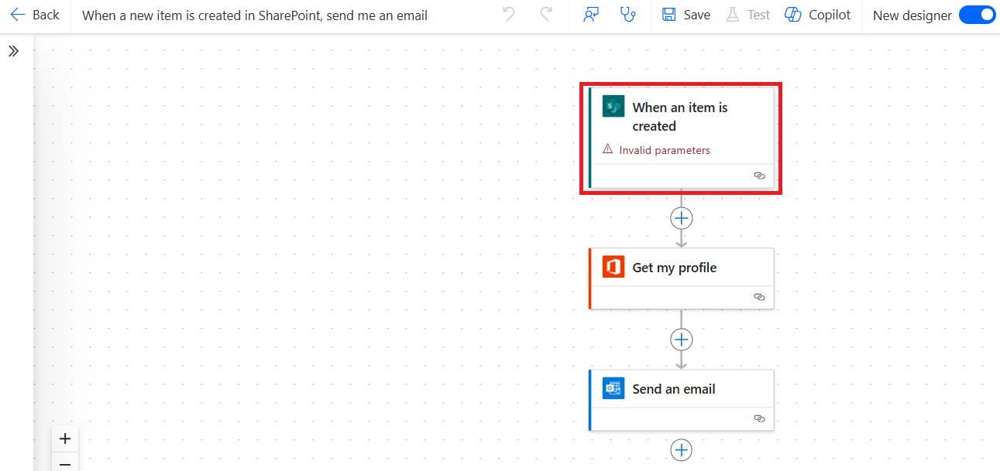

21. To finalize your flow, configure the required settings. Under the
    **Site address** field, click on dropdown menu and select
    **Testing** site address.

    **Note**: If 'Testing' site is not listed in the drop-down, you can select **Enter custom value**, copy site address from SharePoint Testing site and paste here manually.
 
     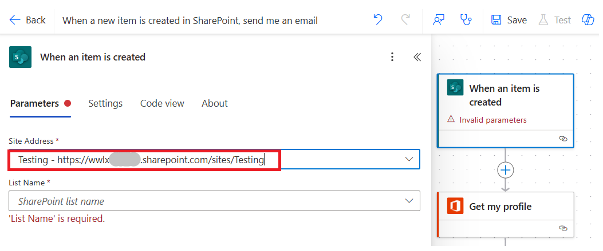

22. For the **List Name**, select **Mylist** from the dropdown and then
    select Collapse icon to close the pane.

     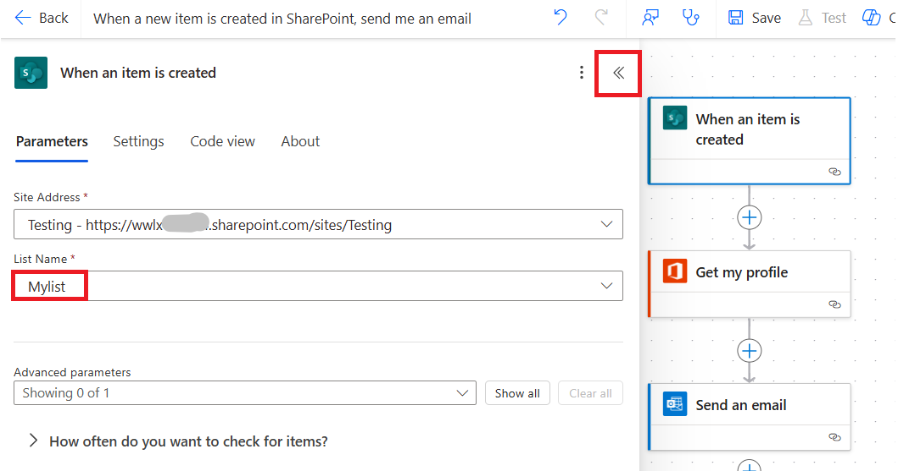

23. Now, select the third step – **Send an email**.

     

24. Under Send an email, you can see **Subject** and **Body** part are
    already generated by the copilot. Select Collapse icon to close the
    pane.

     **Note:** In case subject and body parts are not generated by copilot
     then you can type as shown in the below figure.
    
     

25. Select **Save** to save the flow.

     

## **Task 2: Test the flow**

1.  Select **Test** to test the flow.

     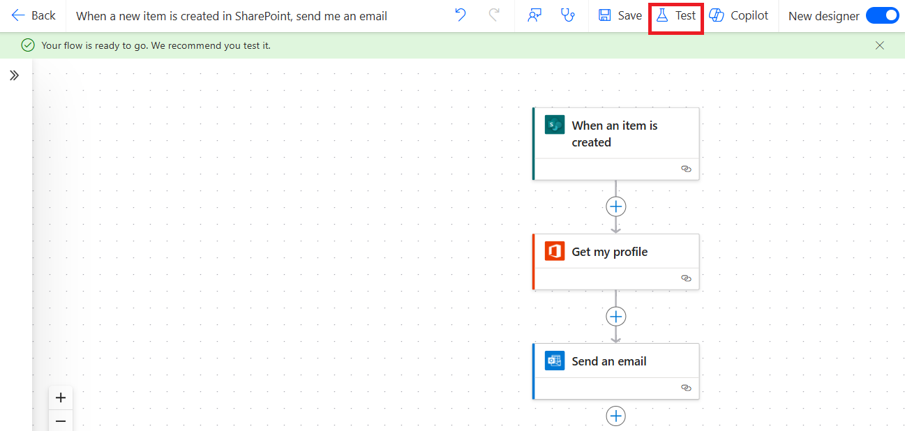

2.  Select **Manually** and then select **Test**.

     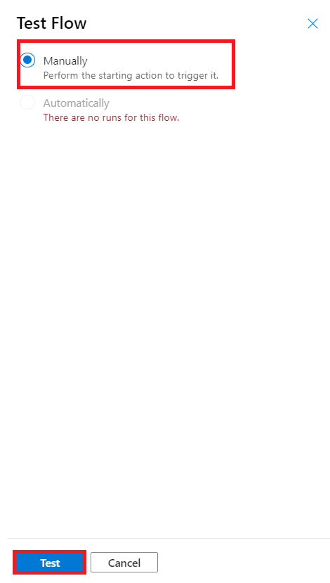

3.  To run the flow, create an item in the list in SharePoint.
    Considering you are on **Testing site > Mylist** page, select
    **+Add new item**.

     

4.  Enter **Testitem** under **Title** and then click on **Save**.

     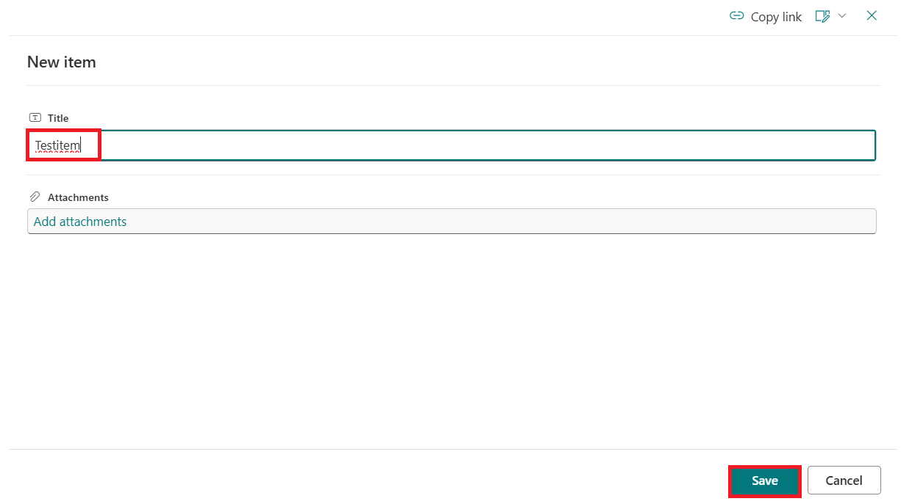

5.  Your flow is running now, to check the status, come back to Power
    Automate portal, click on back arrow **\<-** appearing before the
    name of the flow.

     

6.  Select **Got it** on **Your flow is ready to go** pop-up window.

     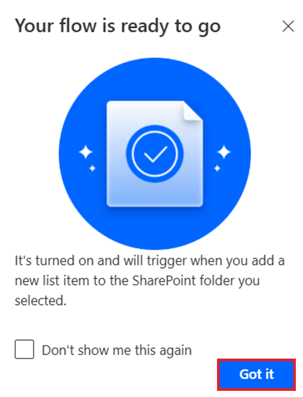

7.  You can see the status **Succeeded** under the run history. If you
    don’t see the status, refresh the window.

     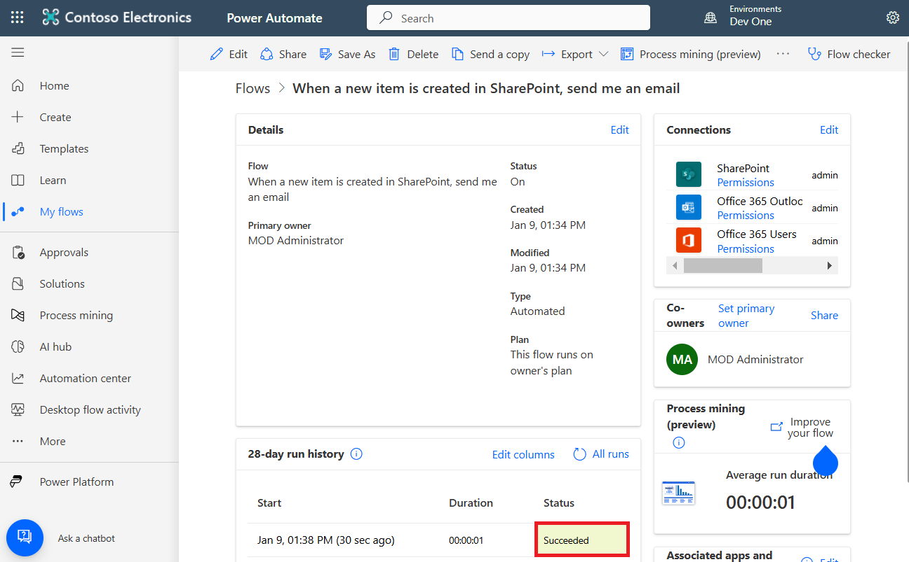

8.  You can also check the Email received to the MOD Admin. Select App
    launcher from the top left on Power Automate page. Select
    **Outlook**.

     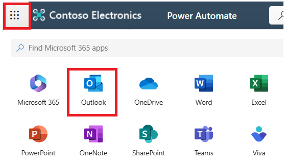

9.  You can see the Email.

     
