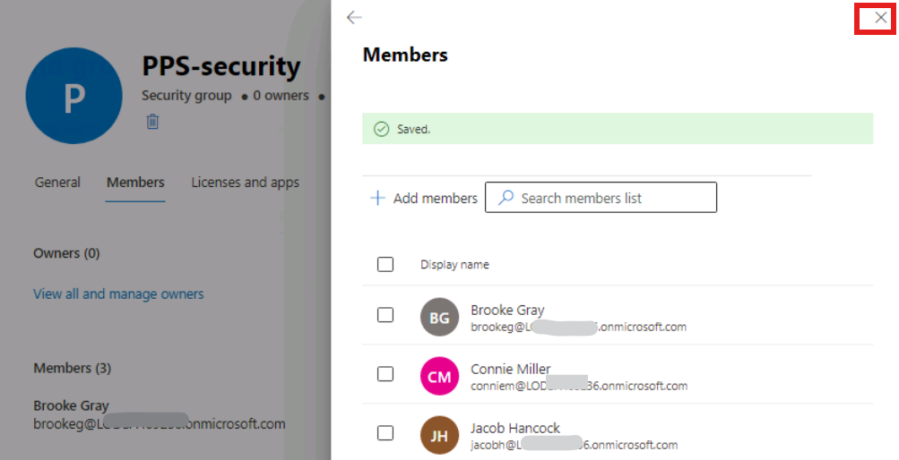
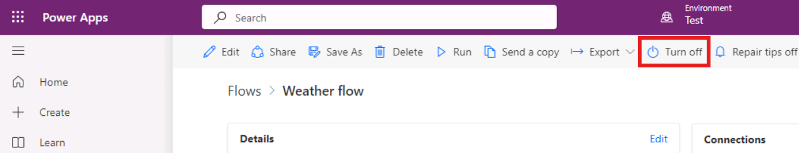
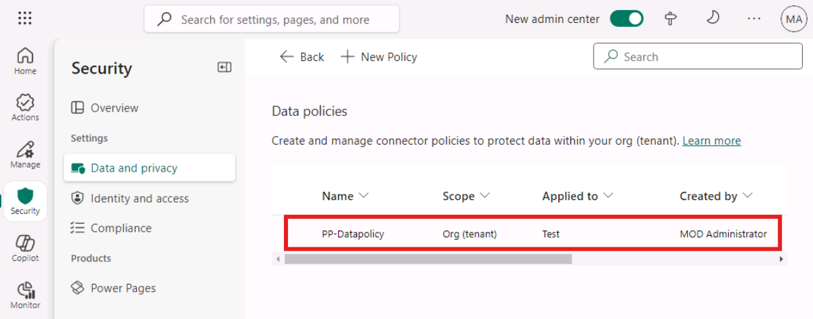
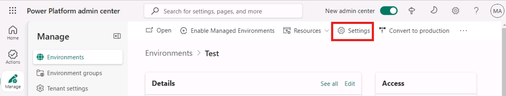

# **Lab 5 - Implementing Security and Governance**

**Objective**: In this lab, you will learn how to use security groups to control which licensed users can access a specific environment. You will also explore how to create Data Loss Prevention (DLP) policies and understand their impact on cloud flows. Finally, you will learn to create Microsoft Dataverse teams and manage the security roles of a team.

## **Exercise 1: Control user access to environments: security groups and licenses**

### **Task 1: Create a security group and add members to the security group**

1.  Open new tab in the same browser and navigate to **Microsoft 365
    admin
    center** using +++**https://admin.microsoft.com**+++.
    Sign in with your Office 365 tenant credentials.

2.  Select **Teams & groups** > **Active teams & groups**.

     

3.  Select **Security group** tab and then select **+Add a security
    group**.

     

4.  Add the group Name: +++**PPS-security**+++
    and Description:+++**Power Platform
    architecture and governance security group**+++ and then click **Next**.

     

6.  Click on **Create group** button.

     

7.  Click on **Close** button to close the window.

     

8.  Click on the group you created, select the **Members** tab and then click
    on **View all and managed members** hyper link.

     

9.  Click on **+ Add members**.

     

10. Select the first three users (For example here, Adele, Alex and
    Allan) to add to the security group and then select **Add(3)**.

     

11. **Close** the ‘Members’ pane to return to the **Groups** list.

     

12. You have completed this task, please do not close the tab and 
    proceed ahead with the next task.

### **Task 2: Associate a security group with a Dataverse environment**

1.  Opena  new tab and navigate to the Power Platform admin center
    using +++**https://admin.powerplatform.microsoft.com**+++ and
    if required, sign in with your Office 365 tenant credentials. 

3.  In the navigation pane, select **Manage** > **Environments**, and
    then select **+New**.

     

4.  On the **New environment** window, enter the following information and then select **Next**.

     **Name**: +++Test+++
    
     **Region**: United States – Default
    
     **Type**: Trial
    
     **Add a Dataverse data store**: Yes

     

     

5.  Select **Language**: English (United States), **Currency**: USD. Click on **+Select** under **Security group**.

     

6.  Under the **Restricted access**, select **PPS-Security** and then
    select **Done**.

     

7.  You can see under Security group, PPS-security group is added and
    then select **Save**.

     
    
     You have completed this task, do not close the browser and proceed
     ahead with the next Exercise.

## **Exercise 2: Evaluate impact of adding DLP**

**Scenario**

In this exercise, you will be creating an environment, creating a flow,
and then viewing the impact of adding a DLP policy.

### **Task 1: Create a flow to get the weather**

1.  Switch back to **Power Apps maker
    portal** +++https://make.powerapps.com+++ tab
    and make sure you have signed in with your Office 365 tenant
    credentials. 

2.  Select the trial environment – **Test**.

     

3.  Select **Flows** from the left. Click **+ New flow** and
    select **Scheduled cloud flow.**

     

4.  Enter +++Weather flow+++ for **Name**,
    select **Repeat every 1 Day**, and click **Create**.

     

5.  Click **+ New step**.

     

6.  Search +++**msn**+++ and select **Get current weather**. 

     

7.  Provide your **Location** - +++Denver+++, select **Units - Imperial**, and
    click **+ New step**.

     

8.  Search for +++**send email**+++ and select **Send an email (V2) Office 365
    Outlook**.

     

9.  Enter **brooke** in the **To** field and select **brookeg@LODSA7xx479.onmicrosoft.com** email from the suggestion. Enter +++Current Weather+++ for **Subject**.

10. Click on the Body enter +++Current weather for:+++ and select **Location** from the
    Dynamic content pane.

     

11. Hit the **ENTER** key,
    enter +++Temperature:+++ and
    select **Temperature** form the Dynamic content pane.

12. Hit the **ENTER** key,
    enter +++Conditions:+++ and
    select **Conditions** form the Dynamic content pane.

13. You may add other values to the email.

     

14. Click **Save**.

     

15. Go to **Flows** by clicking on the back arrow located on the top
    left of the designer window (Before the flow name).

     

16. Click **Flow name** to open the flow.

     

17. Make sure the flow is **On**. Select **Turn on**, if the flow is turned
    off.

     

18. Click **Run** and then click **Run flow**.

     
    
     

19. Click **Done** and wait for the flow run to complete.

     

20. Click on the **Refresh** button to see the update status.

     

21. Open a new InPrivate browser tab and browse
    to +++https://outlook.office.com+++ sign
    in with +++brookeg@LODSA7xx479.onmicrosoft.com+++ (change the domain name in your log in id) and
    Password: +++Pa$$w0rd@124+++

22. You should get an email with the weather information.

     

23. You have completed this task, please do not close the tab. Proceed
    ahead with the next task.

### **Task 2: Create a DLP Policy**

In this task you will create an environment specific DLP and see how it
impacts your working flow.

1.  Switch back to **Power Platform admin center**
    +++https://admin.powerplatform.microsoft.com+++ tab
    and make sure you have signed in with your Office 365 Admin tenant
    credentials.

3.  Select **Security** from left navigation pane. Select **Data and privacy** and then select **Data policy**.

     

4.  Click **+ New Policy**.

     

5.  Enter name of the policy +++PP-Datapolicy+++ and click **Next**.

     

6.  Search for +++Dataverse+++,
    select **Microsoft Dataverse**, and click **Move to Business**. 
    Choose carefully, you may have to expand the Name column to
    differentiate between connectors in your search results.

     

7.  Search for +++SharePoint+++, select **SharePoint,** and click **Move
    to Business**.

     

8.  Search for +++Outlook+++, select **Office 365 Outlook,** and
    click **Move to Business**.

     

9.  Select the **Business** tab and you should now have three connectors
    moved to Business. Click **Next**.

     

10. Do not add any connectors and click on **Next**.

     

11. In **Scope**, select **Add multiple environments** and then
    click **Next.**

     

12. Select your **Test** trial environment and then click on **+Add to
    policy**.

    

13. Select **Added to policy** tab and then click **Next**.

     

14. **Review** the policy and then click on **Create policy**.

     

15. Your **Policy** got created.

     

16. Click on **App Launcher** and then select Outlook.

     

17. You should see an **Alert** email saying **Flow suspended due to
    violation of Data Loss Prevention policy** (It can take up to 5 minutes for the email to be generated.)

     

18. Switch back to **Power
    Apps** +++https://make.powerapps.com+++ and
    if required, sign in with your Office 365 tenant credentials.

19. Select **Flows**, select **Weather flow**.

     

20. Flow should now be suspended because of the DLP you created. Click
    on it to open the flow. If you don't see the status as 'Suspended', try refreshing the page.

     

21. You should not be able to **run** the flow.

     
    
     **Note:**  After you finish this lab if you have time come back and
     modify the DLP you created to fix the problem.  If you have trouble
     getting it to work, ask your instructor for some tips.

22. You have completed this task, please do not close the browser.
    Proceed ahead with the next task.

## **Exercise 3: Microsoft Dataverse teams management**

### **Task 1: Access your team's page**

1.  Switch back to the **Power Platform Admin Center** tab or navigate
    to +++https://admin.powerplatform.microsoft.com+++ and
    make sure you have signed in with your Office 365 admin tenant
    credentials.

2.  Select **Manage** from left navigation pane. Select **Environments** and
    then click on your **Test** trial environment.

     

3.  Click on **Settings** on top menu bar.

     

4.  Select **Users + permissions** > **Teams**.

     

5.  A list of all the teams in the environment is displayed.

     

### **Task 2: Create a new team**

1.  Select **+ Create team**.

     

2.  Specify the following fields:

    - **Team name:** +++PPS -Test- Team+++

    - **Description:** +++Power Platform+++

    - **Business unit:** Type org and select it from suggestion box

    - **Administrator:** Type admin and
      select your Office 365 admin name, MOD Administrator  from suggestion box 

    - **Team type:** **Microsoft Entra ID Security Group**

    - **Group name:** PPS-security

    - **Membership type:** Members and guests

    - Click **Next**

     

3.  On the Manage security roles pane, scroll down and select **System
    administrator** role and then click on **Save**.

4.  Again click on **Save**.

     

     

### **Task 3: Manage the security roles of a team**

1.  Select the checkbox for a recently created team – **PPS-Test-Team**.
    Select **Manage security roles**.

     

2.  Select **AIB SML Roles**, and then click **Save**.

     

     

3.  You have completed this task. Please remain in the current tab and continue with the next task. 

### **Task 4: Delete a team**

1.  Select the checkbox for the **PPS-Test-Team**. Select **Delete** twice to
    confirm. Note that this action can't be undone.

     

     

2.  You have completed the exercise, please do not close the browser.
    Proceed ahead with the next lab.
