# **Lab 8: Manage Dataverse auditing**

### **Task 1: Start/stop auditing for an environment and set retention policy**

1.  Sign in to the Power Platform admin center using
    +++https://admin.powerplatform.microsoft.com+++
    with your Office 365 admin tenant credentials.

2.  Select **Manage** > **Environments** from left navigation.

    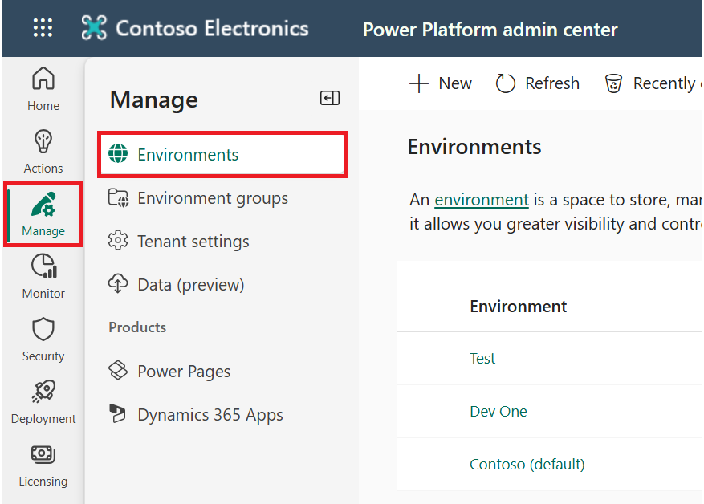

3.  Select **Dev One** environment and then select **Settings**. If the option is not visible then select **More commands** (three dots) from above horizontal palette and then select **Settings**.

    

4.  Expand **Audit and logs** > **Audit settings**.

    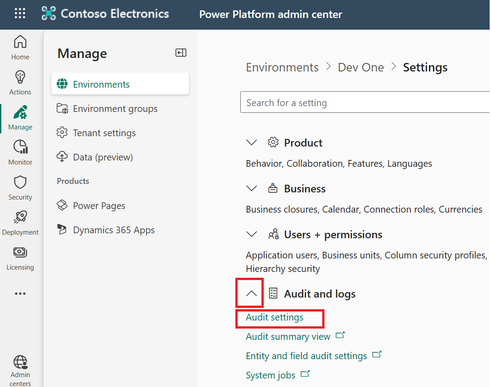

5.  Select **Start auditing** and **Read log** checkbox. Set the
    retention policy for the logs as **90 days**. Select **Save**.

    

    **Note:** When the audit retention period is set to Forever, logs will
    never be deleted.

6.  You have completed this task, please do not close the browser.
    Proceed ahead with the next task.

### **Task 2: Configure auditing for one or more tables and columns in Power Apps**

1.  Go to **Power Apps** portal
    using +++https://make.powerapps.com+++ and
    sign in with your given Office 365 Admin tenant credentials.

2.  Click on the environment selector and select **Dev One** environment
    that contains a Dataverse database.

    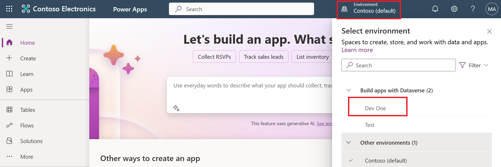

3.  Select **Tables** from left navigation pane and then click to open
    the **Expense Report** Table.

    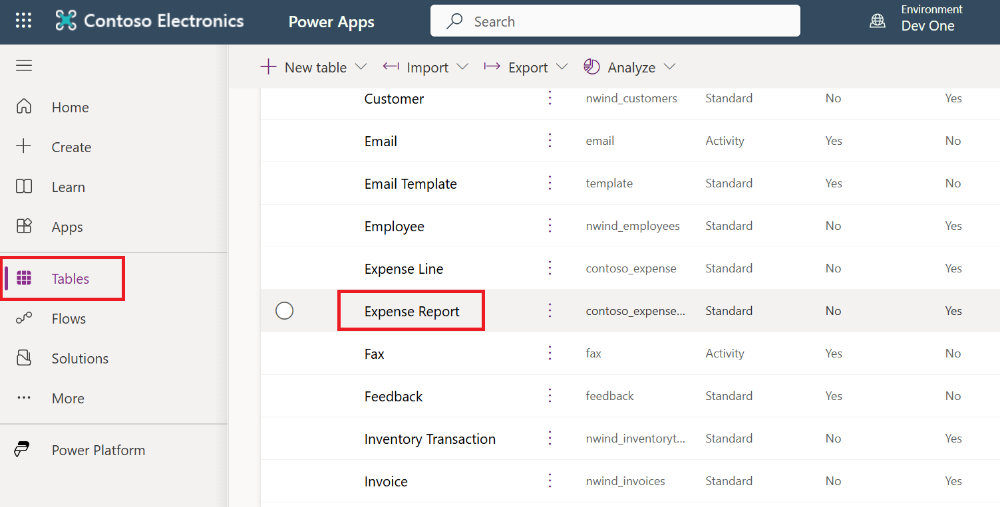

4.  Select **Columns** under Schema.

    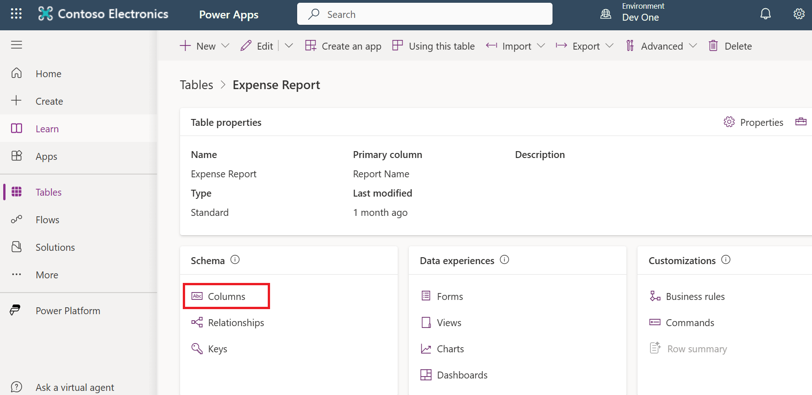

5.  Locate and click to open the **Expense Report** column.

    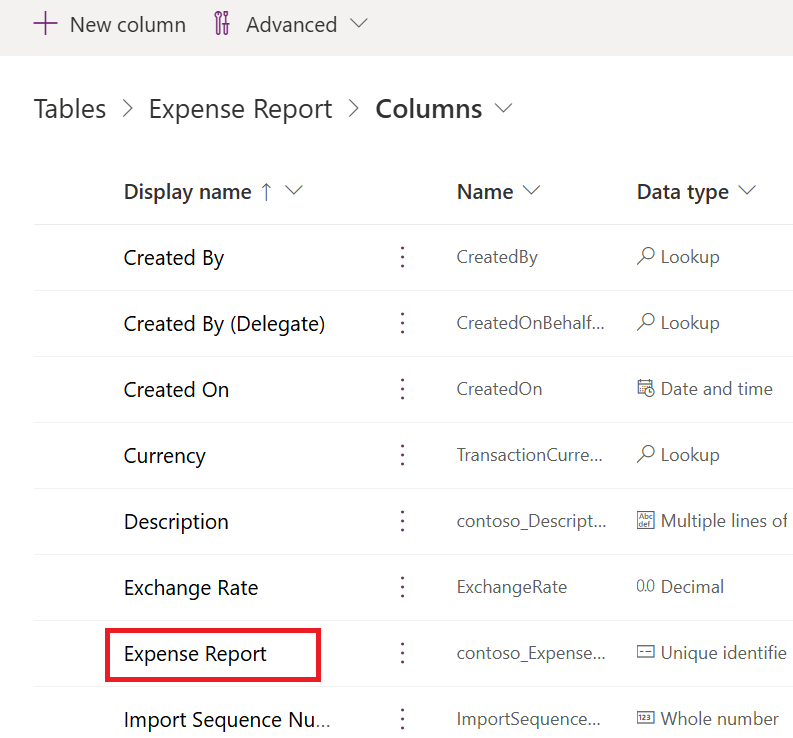

6.  Expand the **Advanced options** section. Select the **Enable
    auditing** checkbox and then click on **Save**.

    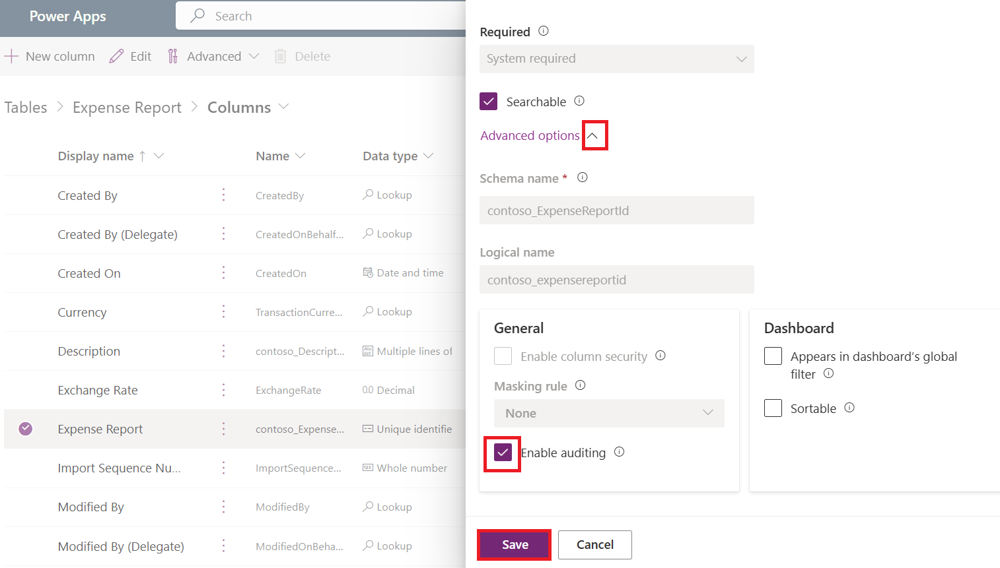

7.  To go back to Expense Report, select **Expense Report** from the
    path.

    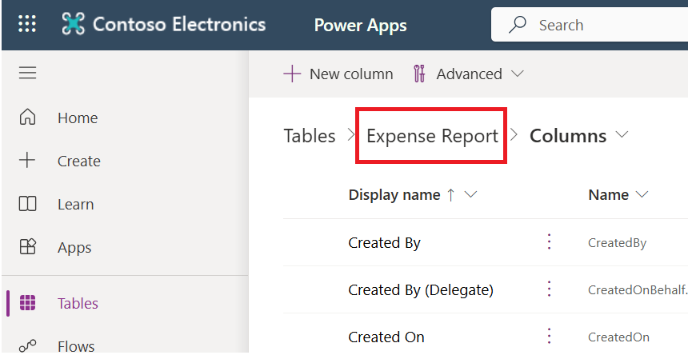

8.  Select **Edit** from the command bar.

    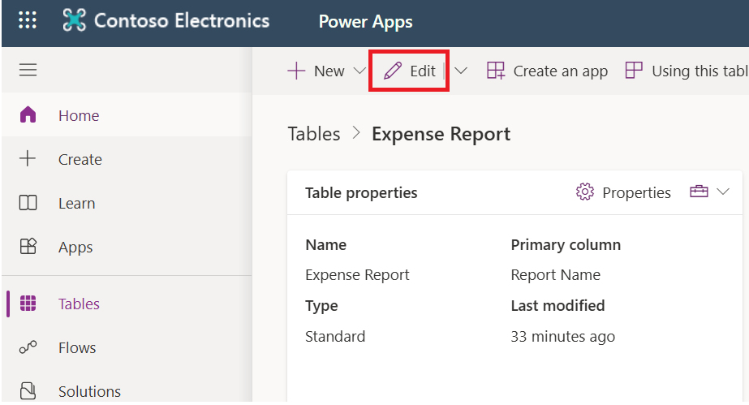

9.  On the command bar, select **Edit table properties**.

    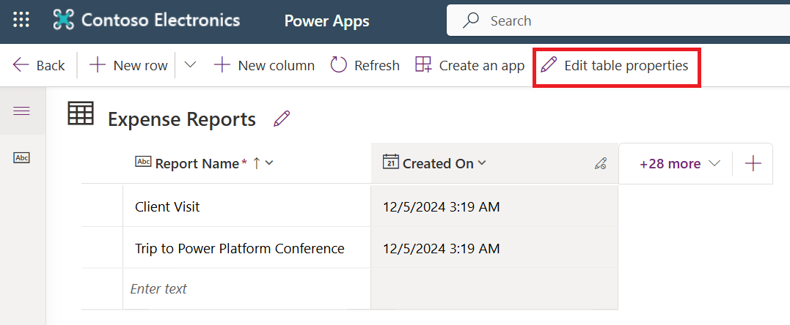

10. Expand **Advanced options**.

    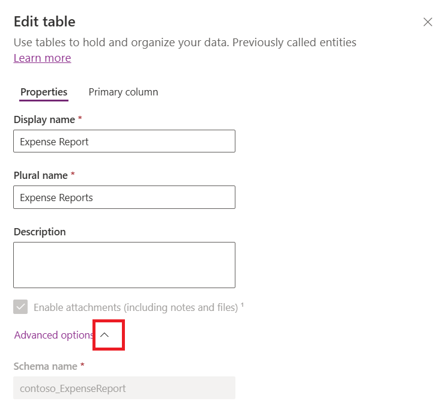

11. Make sure that the **Audit changes to its data** is enabled. Select **Save**.

    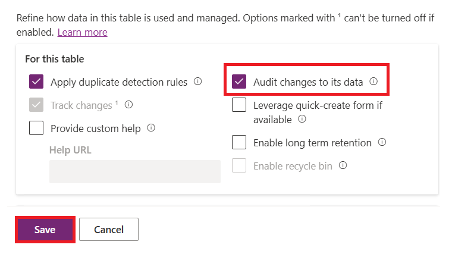

12. Select back arrow to go back to the Expense Reports.

    

13. Select **Advanced** from the command bar and then select **Publish
    table**.

    

14. Wait till you see the message as **Publish succeeded**.

    

### **Task 3: Test auditing**

1.  Select **Apps** and click to launch the **Expense Tracker
    app** application.

    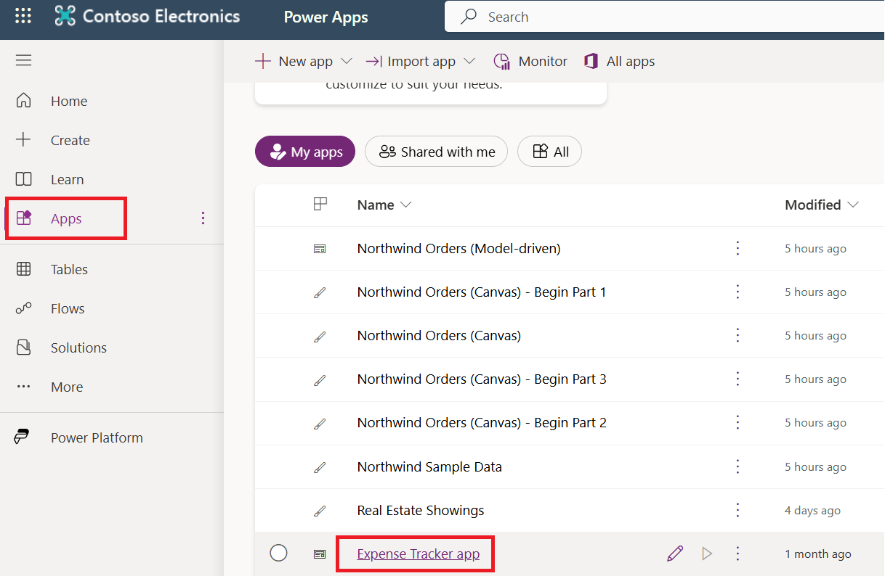

2.  You can see, you are in the Expense Reports tab, select **Client
    Visit** report.

    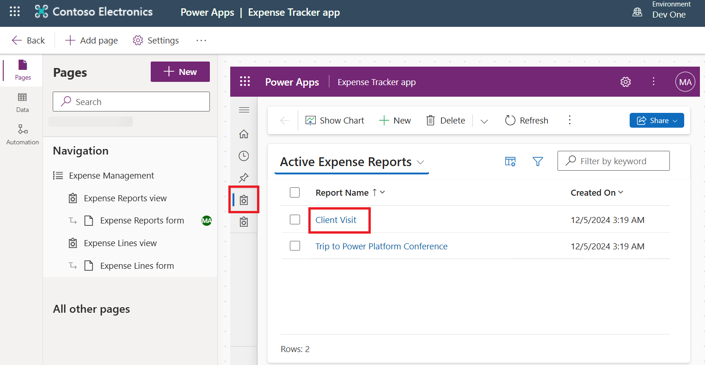

3.  Change the name **Client visit** to **Test visit** and then select
    **Save**.

    

4.  Click **Related** and select **Audit History**.

    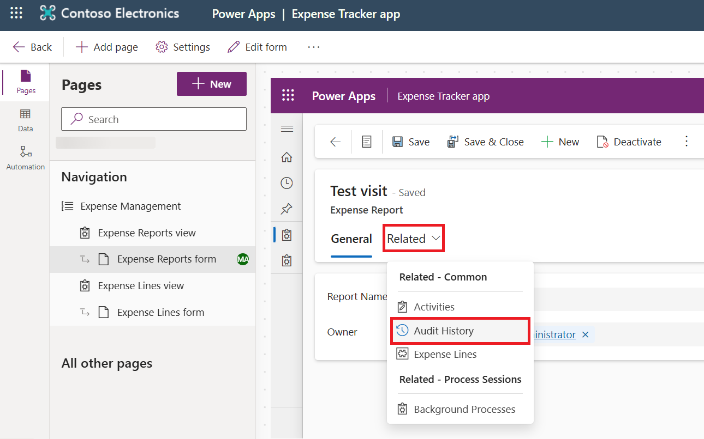

5.  You should see the change history for each of your changes.

    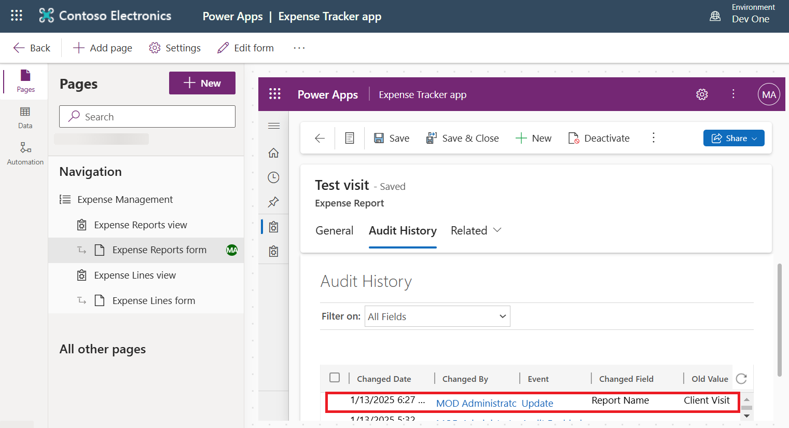
