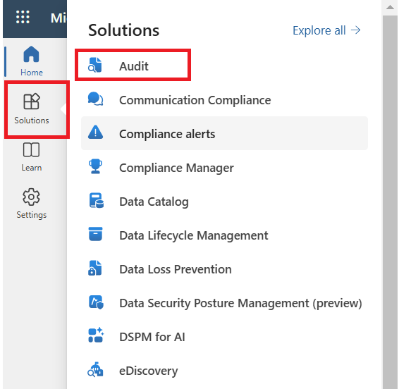
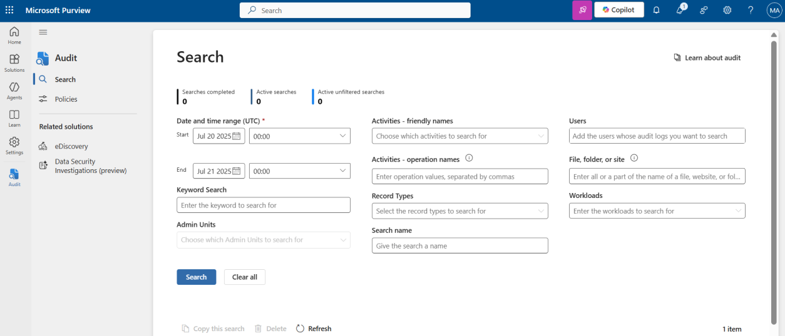
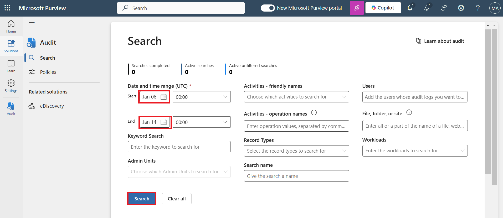
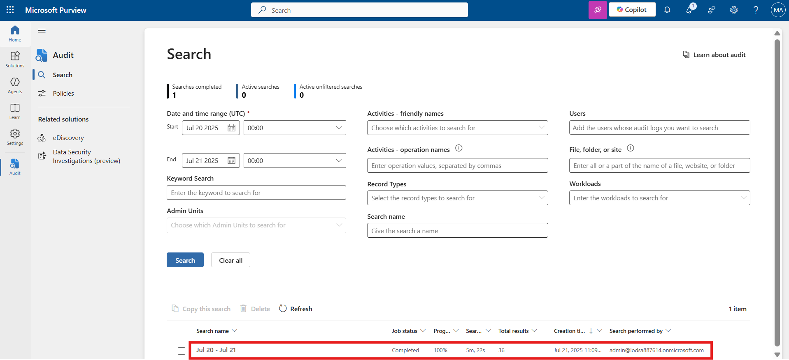

# **Lab 9: Activity logging**

    **Objective**: In this lab you will learn how activities (Power Apps, Power Automate, Datavers etc) are tracked from the Microsoft Purview compliance portal. Logging takes place at the SDK layer, which means a single action can trigger multiple events that are logged.

1.  Sign in to the Microsoft Purview portal using 
    +++https://purview.microsoft.com/+++ with your Office 365 tenant
    credentials.

2.  Accept the **terms and privacy statement** and then click on **Get
    started**.

     

3.  From the left navigation pane, select **Solutions** and then select
    **Audit.**

     

4.  Within the **Audit** log search screen, Power Platform admins can search audit logs across many popular services including eDiscovery, Exchange, Power BI, Microsoft Entra ID, Microsoft Teams, customer engagement apps and Microsoft Power Apps.

     

5.  Configure **Start date** as 3-4 days before the current date and
    **End date** as current date. Select **Search**.

     

6.  You can see the number of Active searches and Active unfiltered
    searches is changed from 0 to 1. Scroll down a little and you can
    also see the search log.

     

7.  Click on Refresh and you can see the job status as **Completed**.

     
